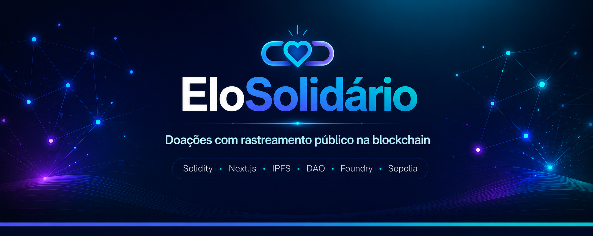

<p align="center">
  
</p>

<h2 align="center"><em>"Você já doou para uma causa e ficou sem saber se o dinheiro chegou lá?"</em></h2>

<h3 align="center">Esse é o problema que o EloSolidário resolve.</h3>

---

# **EloSolidário: A Ideia**

Você já doou para uma instituição e ficou sem saber se aquele dinheiro chegou a algum lugar? A resposta curta é: não tinha como saber mesmo.

O modelo atual de doação tem pelo menos quatro furos sérios:

1. **A opacidade:** Assim que sai da sua carteira, o dinheiro entra num sistema fechado. Quem escreve os relatórios é a própria organização, sem auditoria de fora, e não existe forma de conferir se o valor declarado foi gasto no que prometeram.  
2. **A falta de prova real de impacto:** Mesmo quando uma ONG mostra resultado, a evidência costuma ser PDF, foto ou planilha, documentos que qualquer pessoa com acesso ao sistema edita, apaga ou inventa do zero.  
3. **A governança centralizada:** Um grupo pequeno de administradores decide para onde o dinheiro vai, quais fornecedores são contratados e o que fazer diante de uma suspeita; quem doou não tem voz nessas decisões.  
4. **A ausência de auditoria pública de verdade:** Quando ela existe, é cara, lenta, e só especialista entende. O cidadão comum fica de fora.

Dá pra ver o resultado disso todos os dias: doador desconfia e para de doar; organização desonesta opera sem punição; fornecedor recebe por entrega que nunca aconteceu; e ninguém, nem a própria instituição, consegue provar que aquele dinheiro gerou impacto de verdade.

Esse modelo foi montado sobre papel e confiança, numa época sem tecnologia capaz de criar registro à prova de adulteração, auditoria descentralizada ou decisão coletiva sem intermediário. **Isso mudou.**

## **A Solução**

O EloSolidário usa contratos inteligentes na blockchain Ethereum para fechar essas brechas, uma a uma:

* **Quem decide é quem doa:** Toda decisão importante (aprovar uma instituição nova, contratar um fornecedor, pausar uma operação suspeita) vai a votação on-chain. O peso de cada voto segue a Votação Quadrática (peso \= √(total doado)), que dá voz proporcional a quem doou mais sem deixar ninguém esmagar os pequenos. Quando o quórum é atingido, qualquer participante aciona a execução; não existe um botão que só o administrador aperta.  
* **Nenhum pagamento sai sem prova:** A instituição confirma que recebeu o produto ou serviço, sobe as evidências físicas (fotos georreferenciadas, laudos, dados de sensor IoT) para o IPFS e grava o hash desse arquivo on-chain. O contrato confere esse hash antes de liberar qualquer valor, e a evidência fica accessible para sempre: ninguém edita, ninguém apaga.  
* **Fornecedor só recebe se a comunidade aprovou:** A aprovação passa por proposta e votação da DAO; não existe aprovação manual de administrador. Tentou mandar pagamento para um endereço fora da whitelist? O contrato rejeita na hora, automaticamente.  
* **Qualquer pessoa audita, sem precisar de login:** Não precisa criar conta nem conectar carteira para acompanhar para onde o dinheiro vai. Vem direto da blockchain, e nada do que está lá pode ser editado depois.

## **Como a engrenagem funciona**

Quatro tipos de participante movem essa engrenagem:

| Ator | Quem é | O que faz |
| :---- | :---- | :---- |
| **Operador** | Responsável técnico da plataforma | Abre propostas de governança; usa a chave mestra uma única vez, para cadastrar a primeira instituição |
| **Doador** | Qualquer pessoa disposta a apoiar uma causa | Envia ETH para instituições; vota em propostas e disputas |
| **Instituição** | Organização social aprovada pela DAO | Recebe doações; abre pedidos para fornecedores; confirma entregas; envia provas de impacto |
| **Fornecedor** | Empresa ou pessoa aprovada pela DAO | Recebe pedidos; confirma entregas; recebe pagamento após a confirmação |

## **Lado a lado: O antes e o depois**

| Antes | Com EloSolidário |
| :---- | :---- |
| Relatório editável, sem auditoria | Hash IPFS imutável, registrado on-chain |
| Decisão concentrada em administradores | Votação coletiva: quem atinge quórum executa |
| Fornecedor sem fiscalização | Whitelist on-chain aprovada pela comunidade |
| Auditoria cara e fechada a especialistas | Painel público, sem login, aberto a qualquer pessoa |
| Pagamento liberado sem prova de entrega | Pagamento só sai com Proof of Impact validado |

**Sem intermediários. Sem papel. Sem "confie em nós".**

---

## Para rodar

**1. Clonar**

```bash
git clone --recurse-submodules https://github.com/georgines/impactledger-template.git
```

**2. Instalar**

```bash
cd impactledger-template && cp .env.example .env && yarn install
```

**3. Terminal 1** (deixe aberto e rodando):

```bash
anvil --block-time 1
```

**4. Terminal 2** (após o Terminal 1 estar no ar):

```bash
yarn deploy:local && yarn copy-abis && yarn dev:turbo
```

Acesse **http://localhost:3000**. A primeira tela é pública, sem carteira.

Instruções completas: [Como rodar o projeto localmente ou na Sepolia](docs/execucao.md)

---

## Saiba mais

**Entenda o projeto**

- [Como as peças se conectam por dentro](docs/arquitetura.md)
- [Quais tecnologias foram usadas](docs/tecnologias.md)
- [Todos os fluxos da plataforma por ator](docs/funcionamento.md)

**Verifique você mesmo**

- [Contratos publicados na Sepolia: endereços e Etherscan](docs/contratos.md)
- [Capturas de tela do fluxo principal](docs/demo/screenshots.md)
- [Vídeo de pitch e demonstração](docs/demo/video.md)
- [Slides do Pitch](docs/slider/slider_pitch.html)

**Para desenvolvedores**

- [Como rodar o projeto localmente ou na Sepolia](docs/execucao.md)
- [Como executar os testes](docs/testes.md)
- [Onde foi usado IA no desenvolvimento](docs/ia.md)

---

## Equipe

| | |
|---|---|
| **Georgines** | [@georgines](https://github.com/georgines) |
| **Thiago** | [@thiago](https://github.com/ThiLinhares) |
