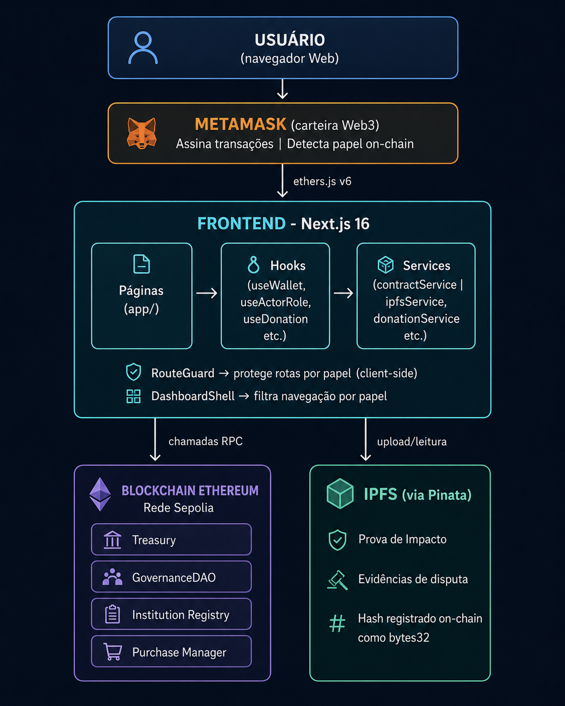

# Arquitetura

[Início](../README.md)

---

## Visão geral



---

## Os quatro contratos inteligentes

| Contrato | Responsabilidade |
|---|---|
| **Treasury** | Recebe doações em ETH; mantém saldo isolado por instituição; libera pagamentos após Proof of Impact validado; guarda o Cofre Central |
| **GovernanceDAO** | Registra propostas on-chain; acumula votos com peso quadrático; qualquer participante pode acionar a finalização após o quórum ser atingido |
| **InstitutionRegistry** | Mantém whitelist de instituições aprovadas; registra pausa e remoção; é consultado pelo frontend para detectar papel |
| **PurchaseManager** | Gerencia ciclo de pedidos (abrir, entregar, confirmar, pagar); bloqueia valor durante entrega; gerencia disputas e evidências IPFS |

Os contratos foram escritos em **Solidity 0.8.24** e usam a biblioteca **OpenZeppelin 5.0** para padrões de segurança. Testados com **Foundry**.

---

## Camadas do frontend

```
app/
├── (pages)/          ← rotas protegidas por papel (RouteGuard)
│   ├── /inicio
│   ├── /fazer-doacao
│   ├── /em-votacao
│   ├── /pedidos-de-compra
│   └── ...
├── layout.tsx        ← monta RouteGuard + DashboardShell
└── page.tsx          ← landing page pública (Mapa do Bem)

hooks/               ← orquestram services + estado React
services/            ← lógica pura, sem React (contractService, ipfsService...)
components/
├── layout/
│   ├── RouteGuard.tsx      ← redireciona se papel não autorizado
│   └── DashboardShell.tsx  ← nav filtrada por papel
└── providers/
    └── WalletProvider.tsx  ← WalletContext global (address, signer, role)
```

---

## Detecção de papel on-chain

Ao conectar a carteira, o frontend consulta três contratos em paralelo: Operador, Instituição, Fornecedor. Se nenhum corresponder, o papel é Doador. O papel determina quais telas são exibidas e quais rotas são acessíveis.

---

[Quais tecnologias foram usadas →](tecnologias.md)
